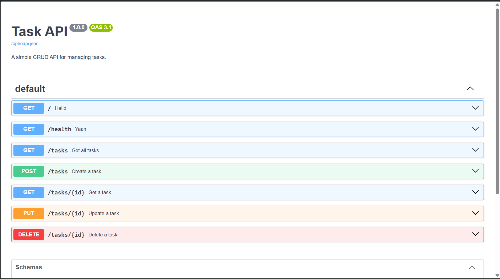

# Task API

A simple CRUD API built with **Python and FastAPI** as part of the **FlyRank AI Backend Internship — Week 2, Assignment 1**.

The API manages a list of tasks using **in-memory storage**. No database is used in this assignment, so all tasks are reset when the server restarts.

## Features

- Create tasks
- Read all tasks
- Read a single task
- Update tasks
- Delete tasks
- Input validation
- Proper HTTP status codes
- Interactive Swagger UI documentation

## Tech Stack

- Python 3.10+
- FastAPI
- Pydantic
- Uvicorn

## Project Structure

```text
task-api/
│
├── main.py
└── README.md
```

## Installation

Clone the repository:

```bash
git clone https://github.com/pushpam345/flyrank-backend.git
cd flyrank-backend

Create a virtual environment:

### Windows

```bash
python -m venv venv
venv\Scripts\activate
```

Install the dependencies:

```bash
pip install fastapi uvicorn
```

## Running the API

Start the server with:

```bash
uvicorn main:app --reload
```

The API will be available at:

```text
http://localhost:8000
```

## Swagger UI

FastAPI automatically provides interactive API documentation.

Open:

```text
http://localhost:8000/docs
```

From Swagger UI, you can test the complete CRUD cycle using the **Try it out** button.

## API Endpoints

| Method | Endpoint | Description | Success |
|---|---|---|---:|
| GET | `/` | Returns API information | 200 |
| GET | `/health` | Checks API health | 200 |
| GET | `/tasks` | Returns all tasks | 200 |
| GET | `/tasks/{id}` | Returns a task by ID | 200 |
| POST | `/tasks` | Creates a new task | 201 |
| PUT | `/tasks/{id}` | Updates a task | 200 |
| DELETE | `/tasks/{id}` | Deletes a task | 204 |

### Error Status Codes

| Status Code | Meaning |
|---:|---|
| 400 | Invalid request body or empty title |
| 404 | Task with the specified ID does not exist |

## Example Requests

### Create a task

```http
POST /tasks
```

Request body:

```json
{
  "title": "Learn FastAPI"
}
```

Example response:

```json
{
  "id": 4,
  "title": "Learn FastAPI",
  "done": false
}
```

Status:

```text
201 Created
```

### Update a task

```http
PUT /tasks/4
```

Request body:

```json
{
  "done": true
}
```

Example response:

```json
{
  "id": 4,
  "title": "Learn FastAPI",
  "done": true
}
```

### Delete a task

```http
DELETE /tasks/4
```

Response:

```text
204 No Content
```

## curl Example

Example of checking a task that does not exist:

```bash
curl -i http://localhost:8000/tasks/99
```

Expected response:

```text
HTTP/1.1 404 Not Found
content-type: application/json

{
  "error": "Task 99 not found"
}
```


## Swagger Screenshot




## Data Storage

This project uses an **in-memory Python list** instead of a database.

Therefore, tasks are lost whenever the server is stopped or restarted.

This is intentional because database persistence is outside the scope of this assignment.

## Assignment

**FlyRank AI — Backend Internship**

**Week 2 - Assignment 1: Build your first CRUD API**
