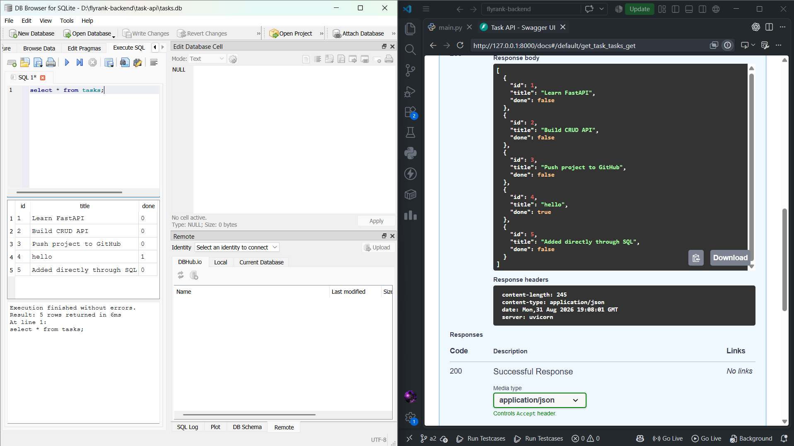

# Task API — FastAPI + SQLite

A simple CRUD API built with FastAPI and SQLite as part of the FlyRank AI Backend Internship.

This project is a continuation of Assignment 1. The API endpoints remain the same, but the storage layer has been migrated from an in-memory Python list to a SQLite database.

## Tech Stack

- Python
- FastAPI
- Pydantic
- SQLite
- Uvicorn

## Project Structure

```text
task-api/
│
├── main.py
├── requirements.txt
├── README.md
├── swagger.png
├── .gitignore
└── tasks.db          # created automatically, not committed
```

## Why SQLite?

SQLite was chosen because it is lightweight and requires zero database-server setup.

The entire database is stored in a single `tasks.db` file, and unlike the in-memory list used in Assignment 1, the data survives when the FastAPI server is stopped and restarted.

## Database

The application uses:

```text
tasks.db
```

The database file is created automatically when the application starts.

The `tasks` table is also created automatically if it does not already exist.

The table contains:

| Column | Type | Description |
|---|---|---|
| id | INTEGER | Primary key, automatically generated |
| title | TEXT | Task title |
| done | INTEGER | Boolean value stored as 0 or 1 |

Three example tasks are inserted only when the table is empty, so restarting the server does not create duplicate seed data.

## Installation

Create a virtual environment:

```bash
python -m venv venv
```

Activate it on Windows:

```bash
venv\Scripts\activate
```

Install dependencies:

```bash
pip install -r requirements.txt
```

## Run the API

From the `task-api` directory, run:

```bash
uvicorn main:app --reload
```

The API will be available at:

```text
http://127.0.0.1:8000
```

Swagger documentation:

```text
http://127.0.0.1:8000/docs
```

## API Endpoints

| Method | Endpoint | Description |
|---|---|---|
| GET | `/` | API information |
| GET | `/health` | Health check |
| GET | `/tasks` | Get all tasks |
| GET | `/tasks/{id}` | Get a task by ID |
| POST | `/tasks` | Create a task |
| PUT | `/tasks/{id}` | Update a task |
| DELETE | `/tasks/{id}` | Delete a task |

## Status Codes

- `200` — Successful request
- `201` — Task successfully created
- `204` — Task successfully deleted
- `400` — Invalid request
- `404` — Task not found

## SQLite Storage

The API uses SQL queries for all CRUD operations.

Examples:

```sql
SELECT * FROM tasks;
```

```sql
SELECT * FROM tasks WHERE id = ?;
```

```sql
INSERT INTO tasks (title, done) VALUES (?, ?);
```

```sql
UPDATE tasks
SET title = ?, done = ?
WHERE id = ?;
```

```sql
DELETE FROM tasks
WHERE id = ?;
```

All user-provided values are passed using parameterized SQL placeholders instead of being directly concatenated into SQL strings.

## Stage 4 — SQL Verification

One SQL query I ran manually in DB Browser for SQLite was:

```sql
SELECT * FROM tasks;
```

This returned the same task rows that were being served by the FastAPI `/tasks` endpoint.

I also inserted a task directly through DB Browser and confirmed that it immediately appeared when calling `GET /tasks` through Swagger. This demonstrated that the API and DB Browser were reading from the same SQLite database file.

## DB Browser Screenshot



## Persistence

Data now survives a server restart because tasks are stored in `tasks.db` instead of a Python list.

For example:

1. Create a task using `POST /tasks`.
2. Stop the FastAPI server.
3. Start the server again.
4. Call `GET /tasks`.
5. The previously created task is still present.

The database and table are created automatically if they do not exist.

## Assignment 2

This project demonstrates the migration from:

```text
Client → FastAPI → Python list
```

to:

```text
Client → FastAPI → SQLite database
```

The API endpoints and their behavior remain the same while the storage layer has changed.

## Author

Pushpam Rastogi

FlyRank AI — Backend Internship